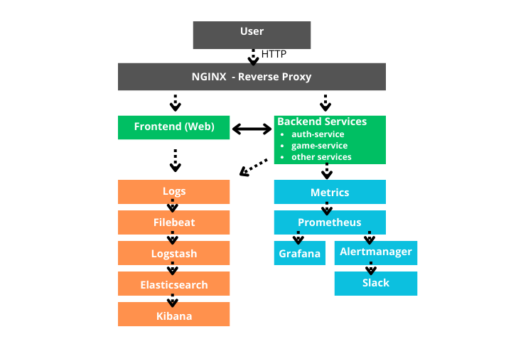
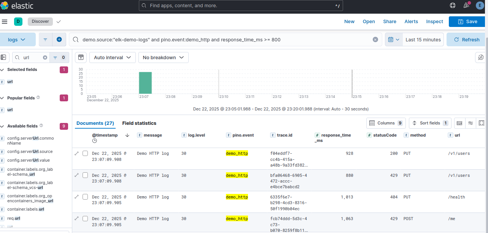
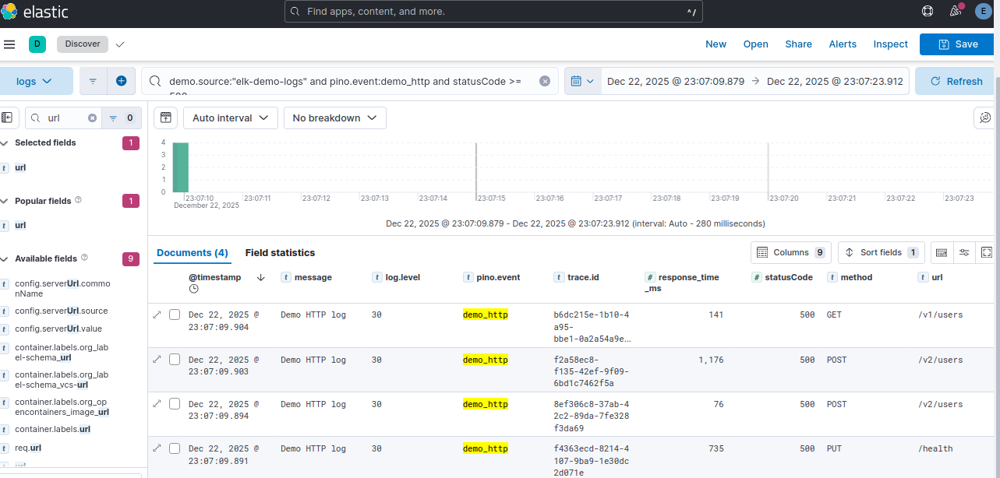
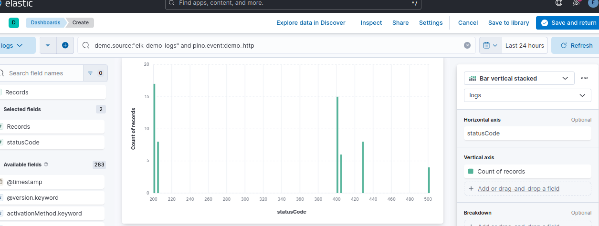

# 🛠 Infrastructure & DevOps Overview

This document details the infrastructure, observability stack, and operational
choices made for the ft_transcendence project.

## Table of Contents

- [1. Architecture & Container Orchestration](#-1-architecture--container-orchestration)
- [2. Logging Stack (ELK + Filebeat)](#-2-logging-stack-elk--filebeat)
- [3. Monitoring (Prometheus/Grafana)](#-3-monitoring-prometheusgrafana)
- [4. Alerting (Prometheus + Alertmanager → Slack)](#-4-alerting-prometheus--alertmanager--slack)


---

# 🔹 1. Architecture & Container Orchestration


**🧩 Global Architecture**



> *High-level overview showing traffic flow, service separation, and observability layers.*


**🐳 Container Orchestration**
- One container per service
- Stateless services where possible
- Shared networks for internal communication
- Centralized reverse proxy (NGINX)
<br>
<br>

The project is fully containerized using **Docker Compose**, following a **microservices design**.

Each responsibility (application, logging, monitoring, alerting, security) runs in a **dedicated container**, improving isolation and operability.

Each backend service (`auth-service`, `game-service`, `database`, `blockchain`) runs independently.
<br>

The infrastructure stack is also separated:
* **ELK + Filebeat** (logging)
* **Prometheus / Grafana / Alertmanager** (monitoring & alerting)
* **NGINX** as a centralized reverse proxy
<br>

⚠️ services are exposed only for local development and debugging, prioritizes speed and debuggability.
<br>

✅ in a production setup, access would be restricted to the NGINX entry point, prioritizes security and controlled access.
<br>

Services are **stateless whenever possible**, while persistent data is handled explicitly via **named volumes**.
Internal communication relies on **Docker networks**.
<br>
<br>


**📸 Screenshot (docker ps)**


> *Overview of running containers showing service isolation across application, logging, monitoring, alerting, and security layers.*
<br>


---

# 🔹 2. Logging Stack (ELK + Filebeat)

**Centralized logging for a containerized microservice architecture using Elasticsearch + Logstash + Kibana and Filebeat.**
**Goal:** production-grade log visibility (debugging, performance insights, dashboards) with secure-by-default access and controlled retention.

<br>
<br>

**🔁 Data flow**

* **Containers → stdout/stderr** (structured JSON logs)
* **Filebeat** harvests Docker logs at scale
* **Logstash** parses/enriches/routes events
* **Elasticsearch** indexes logs for fast search & aggregations
* **Kibana** provides Discover + dashboards
<br>

**⚙️ Others**

* **Retention:** ILM policy (delete-after-14d) to prevent unbounded storage growth.
* **Security baseline:** restricted exposure + auth layer and secrets via environment variables.

<br>

**🚚 Why Filebeat + Logstash (instead of Logstash alone)**

* **Scalability:** Filebeat is lightweight and built for tailing many container log files.
* **Reliability:** Filebeat handles backpressure/buffering and reduces log loss during spikes if Logstash slows down.
* **Separation of concerns:**

  * **Filebeat = shipper** (collection)
  * **Logstash = processor** (parsing/normalization/routing)

<br>

**🧪 Tests logs**

I added **elk-demo-logs.ts** to generate realistic, structured test logs (HTTP traffic, latency, 4xx/5xx, and business events) to validate the full **Filebeat → Logstash → Elasticsearch** pipeline and build Kibana dashboards.
Here are some examples below:
<br>
<br>

**📸 Screenshots (Kibana)**

**📍 Screenshot 1 — Slow HTTP requests (> 800ms)**

To quickly spot real performance issues in production.
ex: overloaded endpoints, slow database queries, external dependency latency, or resource saturation.

**KQL**

```
demo.source:"elk-demo-logs" and pino.event:demo_http and response_time_ms >= 800
```


<br>
<br>

**📍 Screenshot 2 — Discover: HTTP 5xx errors**

Focuses on **server-side errors** to quickly isolate failing routes/services.

**KQL**

```
demo.source:"elk-demo-logs" and pino.event:demo_http and statusCode >= 500
```


<br>
<br>

**📍 Screenshot 3 — Dashboard: HTTP status code distribution**

A dashboard visualization that highlights **global service health** via status code distribution.

**Lens config**

* **Filter KQL**

```
demo.source:"elk-demo-logs" and pino.event:demo_http
```

* **Metric:** Count
* **Break down by:** Top values of `statusCode`

**How to interpret this panel (real production value)**

* **Mostly 200/201/204** → service healthy
* **Many 404** → incorrect routes / client misconfiguration
* **Many 401** → auth/token issues
* **Many 429** → rate limiting / traffic bursts
* **Any 500** → server bugs, crashes, DB failures, unhandled exceptions



<br>
<br>

---

# 🔹 3. Monitoring (Prometheus/Grafana)

📈 Metrics are collected with Prometheus and visualized in Grafana.

This project includes basic production-oriented observability using Prometheus and Grafana.

Application metrics are exposed using `prom-client` and scraped by Prometheus.

A Grafana dashboard is used to visualize and correlate key signals such as traffic,
CPU usage, p95 latency and service availability.
<br>
<br>

**📸 Screenshots (Grafana)**

Synthetic HTTP traffic was generated using `hey` (20,000 requests) to observe how request rate, CPU usage and p95 latency evolve under load.
  ```bash
  hey -n 20000 -c 100 http://localhost:4000/health

  
```


  
This dashboard provides a production-oriented view of the application using Prometheus and Grafana.
It correlates HTTP request rate, CPU usage, p95 latency and service availability.

Helps understand system behavior, detect anomalies and reason about potential incidents.

The dashboard focuses on:

* HTTP request rate (traffic)

  ```promql
  sum(rate(http_requests_total[5m]))
  ```

* CPU usage at container level

  ```promql
  sum by (container) (rate(container_cpu_usage_seconds_total{container!=""}[5m]))
  ```

* p95 latency to reflect user experience

  ```promql
  histogram_quantile(0.95, sum by (le) (rate(http_request_duration_seconds_bucket[5m])))
  ```

* Service availability (UP metric)

  ```promql
  up
  ```
<br>
<br>
<br>

---

# 🔹 4. Alerting (Prometheus + Alertmanager → Slack)

**🚨 Production-like Alerting Pipeline**

I implemented a production-like alerting pipeline based on Prometheus alert rules (`alerts.yml`) and Alertmanager, with real-time notifications sent to Slack.

<br>
<br>

**🎯 Objective**

* Quickly detect incidents (service down, high CPU usage, etc.)
* Avoid passive monitoring: the system actively pushes alerts when something goes wrong
* Version alert rules in YAML (infrastructure as code)

<br>
<br>

**🧩 Stack**

* Prometheus: collects metrics and evaluates alert rules (`alerts.yml`)
* Alertmanager: handles alert delivery (grouping, deduplication, repeat intervals) and sends notifications to Slack
* Slack Incoming Webhook: alert reception channel (`#alerts`)

<br>
<br>

**⚠️ Alert Examples**

* InstanceDown: triggers when a service becomes unreachable for a defined period
* AuthServiceHighCPU: triggers when the `auth-service` exceeds CPU usage thresholds

<br>
<br>

**🧪 Validation Tests (intentionally performed)**

To ensure the alerting pipeline works in real conditions, I intentionally simulated incidents:

**1) Service Down**

I deliberately stopped or made a service instance unavailable to trigger `InstanceDown`, then observed:

* the alert in FIRING state in Prometheus
* propagation to Alertmanager
* real-time notification sent to Slack

**2) CPU saturation on `auth-service`**

I generated artificial CPU load on the `auth-service` container:

```bash
CORES=6
DURATION=60

docker exec -d auth-service sh -c "
for i in \$(seq 1 $CORES); do yes > /dev/null & done
sleep $DURATION
pkill yes
"
```

**Expected result**

* visible CPU spike in Grafana / cAdvisor metrics
* AuthServiceHighCPU alert in FIRING
* real-time Slack notification (then RESOLVED once the load drops)
<br>


<br>
<br>

**💡 Why this matters in production**

* write metric-based alerts using PromQL
* test and validate alert behavior under load
* integrate a realistic alerting chain (Prometheus → Alertmanager → Slack)
* think in terms of incident response (fast detection + actionable signals)

> **Note:** the Slack webhook is treated as a secret (.env) and is not committed to the repository.

---


