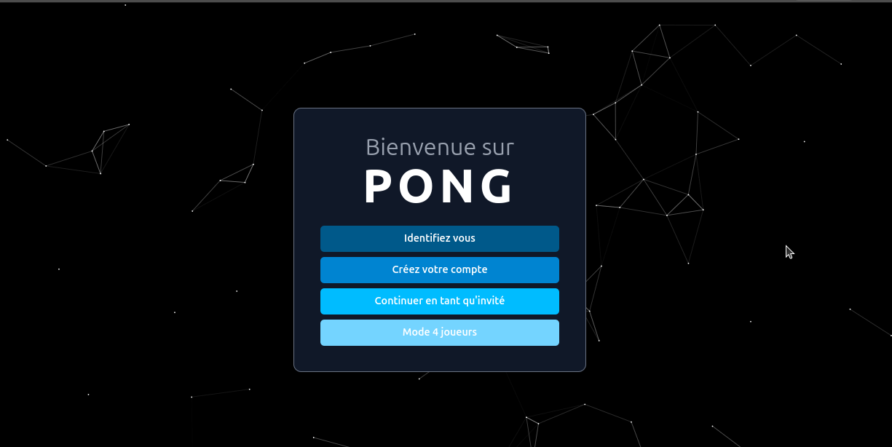
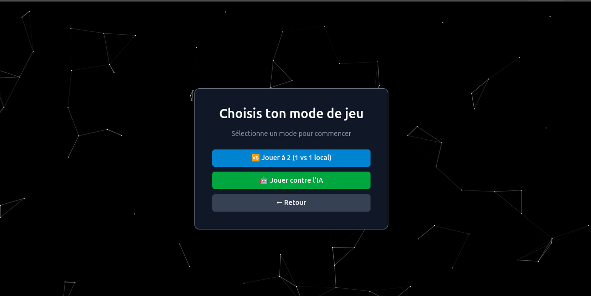
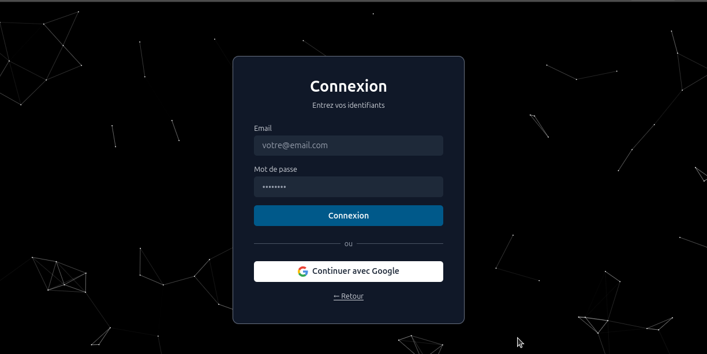
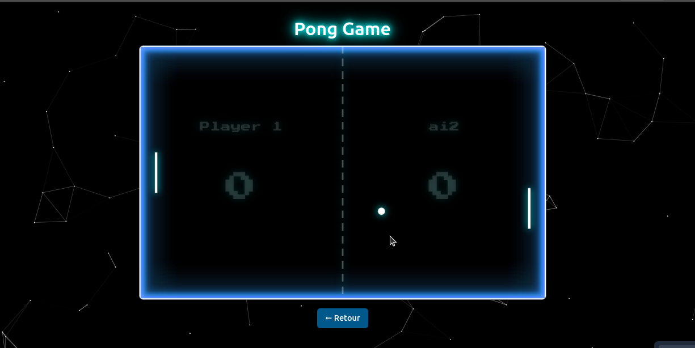
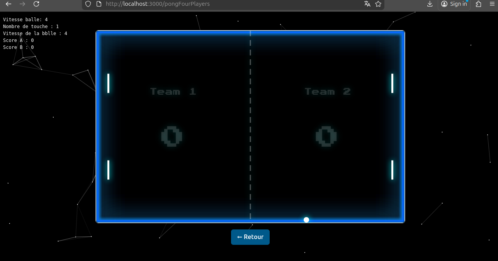
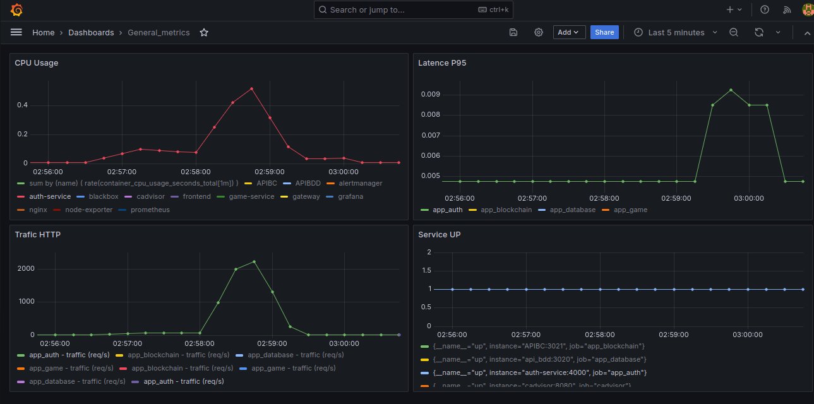
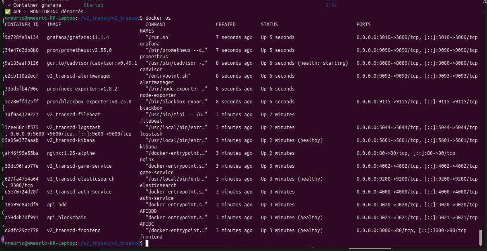
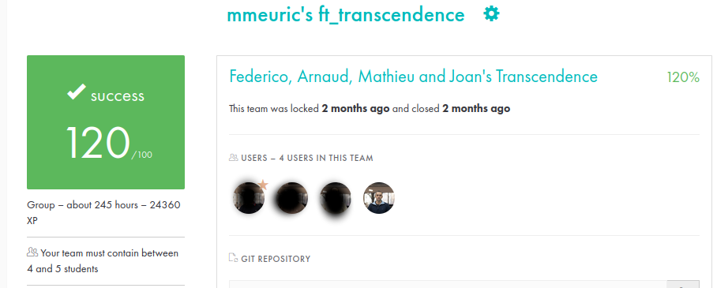

# ft_transcendence
👉 View more about DevOps & Infra here: INFRA_DEVOPS.md  
[Infrastructure & DevOps documentation](INFRA_DEVOPS.md)

<br>

`ft_transcendence` is the final project of **42’s Common Core**: a full-stack web application built as a **team of 4**, designed to be production-like (multi-user, secure, containerized, and runnable with a single command).

This repository contains our complete stack: **frontend + microservices backend + database + reverse-proxy + observability (ELK / Prometheus / Grafana)**.
<br>

📸 **Screenshot project:**
<br>

> 
> 
> 
> 
> 


---

## What we built

* **Web app** with authentication + multi-user features
* **Pong game & tournaments**, including an **AI opponent**
* **Tournament score storage** using a **blockchain module**
* **Security**: JWT + **2FA** + remote authentication (OAuth)
* **DevOps/Infra**: Docker-first deployment, microservices, monitoring & logging

---

## My main contribution (DevOps / Infrastructure)

I was responsible for the **platform & operations layer**, focusing on **reliability, observability, and deployment**:

* **Docker Compose orchestration**: single-command boot for the full stack
* **Microservices infrastructure** (service boundaries, networking, container build/run strategy)
* **Logging stack (ELK)**:

  * Elasticsearch + Logstash + Kibana
  * Log ingestion + parsing pipeline
  * **Retention / lifecycle policy** (ILM) + archiving/snapshot preparation
  * Secured access to components
* **Monitoring stack (Prometheus/Grafana)**:

  * Prometheus scraping strategy + exporters/integrations
  * Grafana dashboards (host + services)
  * Alerting rules + Alertmanager
  * Secured Grafana access

* **Health checks & status mindset** (service readiness / liveness approach)
* **Backups & recovery approach** (automated procedures + operational scripts)

<br>

📸 **Grafana & Docker overview**




👉 View more details here: INFRA_DEVOPS.md  
[Infrastructure & DevOps documentation](INFRA_DEVOPS.md)

---


## Others features (team members)

### Backend / Web

* **Fastify + Node.js** backend (TypeScript)
* Backend structured as **microservices**
* **SQLite** database service
* **API Gateway** to expose services

### Frontend

* TypeScript SPA
* Styling with **Tailwind CSS**

### Security & User Management

* Standard auth + tournaments users management
* **Remote authentication (OAuth)**
* **JWT** + **2FA**

### Game / AI / Blockchain

* Pong & tournament system
* AI opponent + stats dashboards
* Tournament score recorded via blockchain module

---

## Tech stack

* **Orchestration:** Docker, Docker Compose, Makefile
* **Reverse proxy / edge:** NGINX (and security rules where applicable)
* **Backend:** Node.js, TypeScript, Fastify, Microservices
* **Database:** SQLite (service + schema)
* **Observability:** ELK (Elasticsearch/Logstash/Kibana), Prometheus, Grafana, Alertmanager, Blackbox
* **Security:** JWT, 2FA, OAuth

---

## Project layout

```text
.
├── docker-compose.yml
├── Makefile
├── backend/
│   ├── gateway/
│   ├── api-auth-user/
│   ├── game-service/
│   ├── database/
│   └── blockchain/
├── frontend/
└── infra/
    ├── reverse-proxy/
    ├── elk/
    │   ├── elasticsearch/   (ILM, templates, snapshots)
    │   ├── logstash/        (pipelines)
    │   ├── kibana/
    │   └── filebeat/
    └── monitoring/
        ├── prometheus/      (rules + scrape config)
        ├── grafana/         (dashboards + provisioning)
        ├── alertmanager/
        └── blackbox/
```

---

## Run the project

### Requirements

* Docker + Docker Compose

### Start

```bash
make all
# or
docker compose up --build
```

The full stack should start with a single command (frontend, backend services, database, reverse proxy, and observability).

---

## Notes

* Secrets/credentials are managed via environment variables (`.env`) and not committed.

---

## Grade



